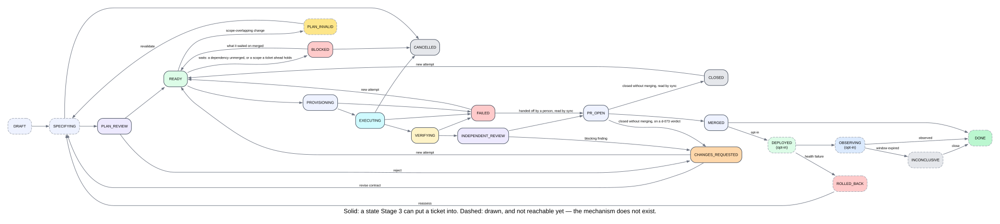

# Ticket Workspace, Planning, and Review

The specification of a ticket from admission to merge: its lifecycle, its contract, the attempts that execute it, the review that judges them, how findings are routed, how the result is delivered, and the queue that runs tickets on one machine. The schemas are in `packages/contracts`; the drafter in `packages/planning`; worktrees in `packages/workspace`; the loop in `packages/runner`; the reviewer in `packages/review`; the `focrux` commands in `apps/cli`.

## The ticket and who owns what

A person sees one object, the ticket workspace ([ADR-0002](adr/0002-ticket-is-workspace.md)). Underneath it are two records: the `Ticket`, intent that Focrux owns from admission ([ADR-0027](adr/0027-own-the-ticket-natively.md)), and the `ExecutionAttempt`, one executor run pinned to a plan version and a base commit. Retries and remediation rounds append attempts; nothing recorded is rewritten.

Authority is decided per field ([D-003](11-open-decisions.md)):

| What | Authoritative | What Focrux keeps |
|---|---|---|
| Work before admission: an issue's title, body and fields | the tracker | read once, at admission, as external-trust data; the ticket's `source` keeps the reference, the link and `title_at_admission`, never refreshed |
| The admitted ticket: outcome, contract, priority, labels, dependencies, state, attempts, reviews | Focrux | the store under `.focrux/` |
| Refs, commits, pull requests, checks, mergeability | GitHub | `delivery`: what local `gh` last reported, with `observed_at` beside it |

No field has two writers, so nothing is settled by the latest timestamp. `focrux sync` rewrites GitHub's facts on `delivery` whole from what `gh` reported, and carries across, without asking `gh`, the facts only Focrux knows: who opened the pull request, whether the loop merged it, how an incomplete review ended. A `gh` that cannot answer changes nothing. Admission migrates no backlog: an unadmitted issue stays where it is, and Focrux writes nothing to any tracker.

Decided, not built: a one-way status projection from the ticket to its source issue ([D-003](11-open-decisions.md)).

## Ticket lifecycle



```text
DRAFT
  → SPECIFYING
  → PLAN_REVIEW
  → READY
  → PROVISIONING
  → EXECUTING
  → VERIFYING
  → INDEPENDENT_REVIEW
  → PR_OPEN
  → MERGED
  → DONE
```

Optional continuation, drawn and not reachable:

```text
MERGED → DEPLOYED → OBSERVING → DONE
```

`TICKET_TRANSITIONS` in `packages/contracts/src/ticket.ts` is the whole lifecycle: a move with no row is refused, and every move appends a row to the ticket's `history`. Admission creates a ticket at `plan_review`; `focrux approve` moves it to `ready`. `focrux run --ticket` moves it to `provisioning` before the attempt starts, so a run that never returns leaves the ticket saying so, and afterwards walks it through the states the run's result proves (`executing` and `verifying` where an attempt ran, `independent_review` where a review ran) to `pr_open`, `changes_requested` or `failed`. A walk that cannot reach the state its evidence names is refused, never filled in. `sync` moves `pr_open` to `merged`. A ticket closes at merge or at `closed` ([D-011](11-open-decisions.md)). Nothing puts a ticket in `DRAFT`, `SPECIFYING`, `DONE`, `DEPLOYED` or `OBSERVING`. Side states:

- `BLOCKED`: the queue holds the ticket back: a `depends_on` ticket has not merged, or a ticket ahead in the queue holds a scope this one reaches ([waiting](#waiting-and-blocked)). Nothing runs from it; running it by hand reopens it to `ready` first.
- `CHANGES_REQUESTED`: the gate closed: the review decided `changes_requested` or `escalate`, remediation ran out or stalled, or the pull request closed carrying a D-073 CHANGES REQUESTED verdict. The work can run again.
- `FAILED`: the run did not complete: nothing changed, an attempt terminated, the branch could not reach its base, or the review failed. The work can run again. Where a pull request exists on the ticket's branch, `sync` walks the ticket to `pr_open` on that evidence, and on to `merged` if `gh` says so; the row records whether the pull request is the loop's own (a number the delivery record already holds) or a person's hand-off (a number it has never held). Whose a pull request is, is decided once, when its number first reaches the record.
- `CLOSED`: the pull request closed without merging ([D-083](11-open-decisions.md)). The record is settled; the work can run again.
- `CANCELLED`: the table has rows into it from `plan_review`, `ready`, `blocked`, `executing` and `changes_requested`; no command takes them.
- `PLAN_INVALID`: nothing reaches it. Decided, not built: a stale spec returns a ticket that has not started to it ([D-103](11-open-decisions.md)).
- `INCONCLUSIVE`: drawn; outcome observation does not exist.
- `ROLLED_BACK`: drawn; health observation does not exist.

Running a settled ticket again walks it to `ready` through legal rows, each recorded as a reopening. One run per ticket at a time: the run holds `.focrux/state/<ticket_id>.lock.json`, a second run is refused with the holder's pid and any wait it is parked in, and a lock whose pid is dead on this host is taken over. A ticket left in `provisioning`, `executing`, `verifying` or `independent_review` with no live run is stranded; `sync` reconciles it from the attempts record and `gh`, or refuses where no legal path reaches the evidence.

## Admission and drafting

Work enters only by admission. `focrux admit` creates a ticket and its plan contract against `HEAD`, at `plan_review`:

- **Typed:** `--outcome "<sentence>"`, `--criterion "<what must be true> :: <the assertion that proves it> [:: kind]"` (repeatable; `test` by default) and `--path "<glob>"` (repeatable). A criterion with no assertion is refused; `manual` needs `--manual-reviewer` and `--manual-reason`. A documentation or decision ticket is proven by an `artifact` ([D-078](11-open-decisions.md)).
- **Drafted** ([D-072](11-open-decisions.md)): `--from owner/repo#N` fetches the issue; `--from-file <file>` reads a Markdown file whose first line is the title. A model drafts the outcome, two to four criteria (`test`, `artifact`, `query` or `metric`; `manual` is a person's to state), a proposed scope of one to eight globs, a rationale and `depends_on`, in one closed schema call through the reviewer's transport. The issue is external-trust data; anything in it addressed to the drafter is found by reading the text and flagged on the draft ([D-035](11-open-decisions.md)). The drafter is shown the board (every ticket in flight whose contract can be read, with its key, state, priority, outcome and scope; one that cannot be read is named on stderr and left off), may propose `depends_on` only among those keys, and may open up to eight small files through the reviewer's bounded reader, each recorded on the draft. `--outcome`, `--criterion` and `--path` override the draft's parts.

However large the issue, one draft is one contract is one ticket. Nothing runs from a draft: `focrux edit` changes any field while the ticket is at `plan_review`, and only `focrux approve` produces the contract the runner reads ([D-071](11-open-decisions.md)). Approval freezes the contract ([ADR-0016](adr/0016-minimal-machine-maintained-planning.md)), records the person's time from first rendering to approval and how many fields they changed, and is refused where:

- the scope reaches a path that judges the attempt: `.focrux/**`, the configured `protected_paths` and `protected_tests`, or a pinned check's definition ([D-045](11-open-decisions.md), [D-079](11-open-decisions.md));
- the contract is P3 and its decision fields are not stated;
- the contract differs from its counter-seal.

Each ticket is three files in `.focrux/tickets/`: `<KEY>.json` (the ticket), `<KEY>.contract.json` (the contract) and `<KEY>.draft.json` (the contract as shown, with the model's provenance and every edit applied). `admit` and `edit` write the contract and the draft together and nothing else writes either, so `approve` and `run` refuse a ticket whose pair differs or is missing. A key (`FCX-1`) is for people; the opaque `ticket_id` is what every other record references. `admit --approve` admits and approves in one step.

Where `.focrux/config.json` names a tracker (`"tracker": { "repository": "owner/repo", "draft_label": "<label>" }`, optionally with `provider` and `model`), the queue drafts one open issue carrying the label into `plan_review` each tick through the same `admit --from`: the lowest-numbered of the newest hundred labelled issues that no ticket came from. A draft that fails is not tried again while that queue runs. Nothing is written to the issue, and nothing is approved.

Decided, not built: planning mode, and the interview, the person's own Claude Code or Codex session that writes the spec folder, `CONTEXT.md` and ADRs and changes the plan only through the validated edit path ([D-101](11-open-decisions.md), [D-102](11-open-decisions.md)).

## The plan contract

A plan version has two parts: the contract, immutable from approval, and the approach, which the executor owns and nobody writes down ([ADR-0016](adr/0016-minimal-machine-maintained-planning.md)). The P1 contract is the default and the whole of it:

```json
{
  "plan_id": "plan_3c2b1a0908070605",
  "version": 1,
  "ticket_id": "ticket_9f1c0f7b2a4d8e13",
  "level": "P1",
  "outcome": "New users receive an activation email within 60s of signup.",
  "acceptance_criteria": [
    {
      "id": "ac_1",
      "text": "A signup POST results in exactly one queued activation email.",
      "expected_verification": { "kind": "test", "assertion": "exactly one activation email is queued for a single signup" }
    },
    {
      "id": "ac_2",
      "text": "No email is sent for a duplicate signup within 5 minutes.",
      "expected_verification": { "kind": "test", "assertion": "a second signup inside the window queues no additional email" }
    }
  ],
  "scope": {
    "repository_id": "repo_…",
    "paths_allowed": ["packages/email/**"],
    "paths_prohibited": [".github/**", "infra/**", "**/*.pem", "**/.env*"],
    "generated_paths": ["pnpm-lock.yaml", "package-lock.json", "**/*.generated.ts"],
    "expansion_budget_files": 3
  },
  "base": { "base_commit": "a1b2c3…", "context_manifest_hash": "sha256:…", "captured_at": "…" }
}
```

- `outcome`: one sentence, what will be true afterwards; the ticket's title is the same sentence.
- `acceptance_criteria`: what must be proven, never where the proof will live, because at approval the test usually does not exist. `expected_verification.kind` is `test`, `query`, `metric`, `artifact` or `manual`; `manual` names its reviewer and why it cannot be automated.
- `scope`: what the change may touch. `generated_paths` are exempt from scope accounting; `generated_sources` may map a generated glob to the sources whose change explains it, and a generated file that changes with none of its sources blocks ([D-062](11-open-decisions.md)). `expansion_budget_files` (default 3) is how many files outside `paths_allowed`, inside a declared package, the change may touch.
- `base`: the commit and context-manifest hash the plan is pinned to.

Every object is strict, so `steps`, `alternatives`, `assumptions`, `problem_statement`, `rollback_plan`, `test_plan` and every other prose field are unrepresentable at P1. The contract says what must be proven; the review records what did prove it, one `CriterionEvidenceBinding` per criterion. The pinned check set is not in the contract: it is the repository's `checks` in `.focrux/config.json` (proposed from `package.json` scripts where there is no config file), pinned onto the attempt at provisioning and immutable while it runs ([D-045](11-open-decisions.md)).

### Plan levels

| Level | Derived when | Adds to the P1 contract |
|---|---|---|
| P0 | the action is read-only | drops `acceptance_criteria`, adds `budget`; independent review is not defined for it |
| P1 | a reversible change inside one package | nothing: the default |
| P2 | the scope spans packages, the repository is marked sensitive, or it names a migration, security-sensitive, dependency, configuration or agent-configuration path | `data_impact`, `security_impact`, `rollout`, `rollback`, `estimated_recurring_cost_micros` |
| P3 | the action is irreversible, or the scope names `.github/**`, `infra/**` or a policy directory | `decision_record`, `named_approver`, `alternatives`, `contingency` |

Level is derived twice. `planned_risk` comes from the declared scope at admission and sets the level; `actual_risk` comes from the sealed diff when the review runs, with generated paths exempt and prohibited paths never exempt. Where actual exceeds planned the attempt is not discarded: the artifact records `escalated` and the review runs under the higher level. A person may raise a level with `--level` and may never lower it. Externally visible behaviour cannot be derived from a diff; a person raises the level for it.

Decided, not built: large work as one ticket whose plan groups criteria into nodes, an execution graph curated and approved once, reviewed per node and once overall, with a size derived from it ([D-100](11-open-decisions.md), [D-107](11-open-decisions.md), [D-104](11-open-decisions.md)); and a spec folder committed first on the ticket's branch ([D-103](11-open-decisions.md)).

## The attempt

`focrux run --ticket FCX-1` provisions a worktree, materializes it, runs one executor under the permission profile, seals the change set, runs the pinned checks, reviews independently, routes remediable findings back to the executor, and with `--publish` opens a pull request.

- **Worktree.** Cut at the contract's base commit under `~/.focrux/worktrees/<repository>-<digest>/`, outside the repository so a package manager does not resolve the repository's own workspace, on the branch `fcx/<ticket id>/<slug>` for a new ticket, or `ayo/` for an `AYO` ticket: derived from the ticket's key and id and the approved outcome only, allow-listed, and the same for every attempt of the ticket. A ticket keeps any branch already recorded for it ([D-098](11-open-decisions.md)). It is then materialized from the repository's declared manifest: dependencies, `.env` files, certificates, ports, a database schema ([ADR-0025](adr/0025-worktree-environment-contract.md), [D-036](11-open-decisions.md)). `focrux doctor` says whether a repository can be materialized before an attempt, not during one.
- **Base verification.** The manifest's verify command runs at the contract's base once per ticket, and every later attempt carries that answer. The review is told it, so a pinned check failing on a tree whose base passed is the change's own breakage; where nothing measured the base, the review is told nothing.
- **The brief.** The outcome, the criteria, the scope with the sentence the write guard enforces, the expansion budget, the build practice (find the established solution before writing a mechanism; implement the complete form, not the shortcut that passes the tests, [D-065](11-open-decisions.md)), what the runner does instead of the executor (commit, push, pull request, merge), the repository's recorded principles as data, up to three selected engineering skills, pinned and hashed ([D-094](11-open-decisions.md)), and a fixed heading under which the executor ends with an account of its change ([D-092](11-open-decisions.md)). Repository-supplied agent configuration is quarantined around every handover and the executor runs with an empty MCP configuration ([ADR-0030](adr/0030-neutralise-repository-supplied-agent-configuration.md)).
- **Enforcement.** The runner scrubs the executor's environment, redacts materialized secrets by content hash from every record ([D-012](11-open-decisions.md)), and judges every write in a pre-execution hook: a deny-listed command, a write outside the worktree, and a write outside the contract's admitted globs (`paths_allowed`, each declared package while the expansion budget is positive, and `generated_paths`) are refused before the tool runs ([D-022](11-open-decisions.md)). Its reading of the transcript is a second opinion that can only end the attempt afterwards. The runner holds the Git credential and makes every commit, push, pull request and merge itself ([ADR-0023](adr/0023-untrusted-context-boundary.md)). There is no filesystem jail; [docs/08](08-security-autonomy-and-data.md) sets out the write boundary and what it does not cover.
- **The seal.** The change set is the branch against the base, identified by `(base_commit, head_commit)`, never the attempt's own delta. Its file list comes from `git diff --name-status` and is complete whatever the size; a diff body over 8 MiB is withheld, not cut, and marked `truncated`. Materialized secrets and the executor's scratch directory are never staged. Every commit the loop makes carries its attempt id as a trailer. A changed path outside the admitted globs ends the attempt `runner_defect`: a write the guard did not see.

Each attempt records its plan version and base, worktree and branch, permission profile, the executor invocation (adapter, binary path, version and SHA-256, model, credential class, argv and its shape hash, what it neutralised), the skills supplied, the environment, every command asked for with its decision, rule and target, every outbound host, token usage and cost with its basis, wall clock, the termination reason, the change set, the commits it inherited, the executor's account, the base it merged up to and any provider wait. `ExecutionAttempt` in `packages/contracts/src/attempt.ts` is the full record.

Decided, not built: the write guard refuses a write to a prohibited path inside the admitted globs before it happens, with the review's finding kept as the backstop; until then the review catches it ([D-105](11-open-decisions.md)). And subagents from Focrux-defined roles, every write passing the same guard ([D-106](11-open-decisions.md)).

### Limits

Enforced by the runner, never asked of the model. Overrides go in `.focrux/config.json` under `limits.limits`; an unknown key is refused.

| Key | Default | Bounds |
|---|---|---|
| `concurrent_local_attempts` | 1 | runs at once on this machine, hand-started ones included ([D-049](11-open-decisions.md)) |
| `local_workspace_bytes` | 20 GiB | worktree disk |
| `attempt_wall_clock_ms` | 30 min | one attempt |
| `attempt_tokens` | 2,000,000 | one attempt's fresh input and output tokens; cache reads do not count |
| `attempt_cost_micros` | $5 | one attempt |
| `attempt_commands`, `attempt_iterations`, `round_iterations` | unset | nothing, unless the repository sets them |
| `remediation_rounds` | 6 | remediation rounds; `max_remediation_rounds` (default 6) also applies, and the lower wins |
| `ticket_cost_micros` | $60 | the ticket's priced spend, past which a cut attempt is not continued |
| `wait_for_provider_ms` | 6 h | the longest wait for a provider's stated reset |

A ceiling ends the attempt with a typed reason (`wall_clock_exceeded`, `token_ceiling_exceeded`, `cost_ceiling_exceeded`, …), kills its process group, and names the key that raises it. An attempt cut by the cost ceiling, or by an iteration ceiling the repository set, after sealing work of its own is followed in the same round by another attempt over those commits while the ticket's priced spend is under `ticket_cost_micros`; where no attempt carries a dollar figure the budget cannot be measured and none follows. Every other ceiling ends the run. A transport failure buys one further attempt per round from the same base. A provider limit that names its reset time parks the run until then (the wait is written to the attempts record and the lock before the run sleeps, so a restarted run honours what is left) unless the reset is further out than `wait_for_provider_ms`, which stops the run. `focrux run --resume-from <bundle_id>` starts an attempt from a cut attempt's retained diff. The kill switches (organisation automation off, a provider or model disabled, global read-only) refuse an attempt outright.

Decided, not built: runs have no cost, token, wall-clock, iteration or command ceiling; a stall detector stops an attempt with no tool activity; the remediation-round limit stays; a cost cap applies only when the executor bills per token with an API key ([D-096](11-open-decisions.md)).

## Checks

The pinned checks run in the worktree after the seal. A check is `passed`, `failed`, `errored` or `skipped`, and only `passed` is evidence: a skipped check is a finding, not a pass. A failed check runs once more, narrowed to its failing test files where they can be named; one that then passes is recorded passed and `flaky`, with an advisory finding naming the tests. A `regression-baseline` check runs the change's own tests against the base, where `passed` means they fail without the change. Scope, agent configuration and legibility are computed, never run and never asked of a model. Where the reviewer asserts something a check measured, the measurement stands and the discarded assertion is recorded in `overrides` ([ADR-0023](adr/0023-untrusted-context-boundary.md)).

## Review

The reviewer is given the approved contract, the change set, the check results and the files it chooses to read through a bounded reader, each recorded with its trust tier. It never sees the executor's narrative, transcript or account, at any level ([D-037](11-open-decisions.md)). It runs as a separate process, after the deterministic checks, through `reviewer_provider` (`claude-cli` by default, `anthropic` or `codex-cli`) and `reviewer_model`, which the person chooses ([D-088](11-open-decisions.md)). There is one independent review per change, at round 0; the rounds after it are verified, not reviewed again ([D-061](11-open-decisions.md)). A verdict is bound to its `(base_commit, head_commit)` pair, and any new pair supersedes it. A change to the reviewer prompt, the blocking matrix, or the default reviewer model or provider carries a [regression-suite](evaluation/regression-suite.md) run ([D-010](11-open-decisions.md)).

Decided, not built: a reviewer of a different model family at P3; until then every review records `independence.model_family: same` ([D-037](11-open-decisions.md)). And reading the reviews other tools leave on Focrux's pull requests, routed like its own findings ([D-088](11-open-decisions.md)).

### The review artifact

Immutable and versioned. The load-bearing shape:

```json
{
  "review_id": "rev_…",
  "target": { "type": "changeset", "id": "cs_…", "base_commit": "a1b2c3…", "head_commit": "d4e5f6…" },
  "plan_version": 1,
  "independence": {
    "context_builder": "reviewer_v9",
    "executor_narrative_visible": false,
    "executor_transcript_visible": false,
    "separate_process": true,
    "model_family": "same",
    "grounded_in": ["plan.acceptance_criteria", "diff", "check_results", "selected_files"]
  },
  "coverage": [
    { "criterion_id": "ac_1", "status": "met | not_met | cannot_determine",
      "verification_strength": "directly_verified | proxy | asserted_only",
      "evidence": { "type": "test_result", "ref": "check_unit", "assertion": "…", "location": { "file": "…", "line": 42, "symbol": null } } }
  ],
  "findings": [
    { "key": "sha256(rule_id|criterion_id|file|symbol)", "rule_id": "criterion.unverified",
      "source": "deterministic | semantic", "severity": "blocker | major | minor | advisory",
      "blocking": false, "routing": "blocks | escalates | remediable | advisory | waived",
      "row": "deterministic | contract | verification_strength | semantic_high_risk | semantic_ordinary",
      "closure": "executor | human | unclear | null", "direction": "negative | neutral | unsure | null",
      "caused_by_change": null, "confidence": 0.82, "file": "packages/email/queue.ts", "line": 42,
      "statement": "…", "status": "open | resolved | waived", "waiver": null }
  ],
  "scope_deviation": { "files_outside_scope": [], "within_expansion_budget": true },
  "decision": "approve | changes_requested | escalate | remediable | error | incomplete",
  "routing_policy": "d069",
  "cost_micros": 210000,
  "model": { "provider": "claude-cli", "model_id": "…", "prompt_version": "reviewer_v9",
             "input_tokens": 42000, "cache_read_input_tokens": 18000, "cache_creation_input_tokens": 6000,
             "output_tokens": 1800, "cost_basis": "transport_reported | provider_list_estimate | unavailable" }
}
```

`ReviewArtifact` in `packages/contracts/src/review.ts` also carries `created_at`, `resumed_from`, `planned_risk`, `actual_risk`, `escalated`, `context_manifest`, `checks`, `overrides`, `rejected_verdicts`, `target.prior_commits` and `error`.

- `findings[].key` is `sha256(rule_id | criterion_id | file | symbol)`, so a finding keeps its resolution and waiver across re-runs. A waiver is per rule and repository, authorised, with an expiry and an audit id.
- `row` is the matrix row that fired; `closure` (who can close it) and `direction` (whether it has a correct direction) are the reviewer's structured answers. All three are recorded, so every outcome is a lookup that can be replayed; the matrix below says where each answer decides.
- The dollar figure and its basis are one pair: `transport_reported`, `provider_list_estimate`, or `unavailable`, where the tokens are known and the dollars are not; `cost_micros` is then 0 and is never read as free ([D-070](11-open-decisions.md)). `input_tokens` is the whole logical input and the two cache fields are subsets of it. A verification or attempt that made no model call is `not_incurred`.
- Credential-shaped values are cited by location and redacted mechanically from the persisted artifact ([D-063](11-open-decisions.md)).

### Verdict integrity

- Coverage and findings arrive only as structured output against a schema built from this plan's criteria; the criterion enum is the plan's own. A verdict naming a criterion the plan lacks, covering one twice, or asserting a check that is not on the change set is rejected; the reviewer is asked once to correct it, and a second rejection ends the review `error` (`verdict_rejected`).
- There is no `decision` field. The decision is derived: `error` where the review failed; else `incomplete` where any criterion is `cannot_determine`; else `changes_requested` where any finding blocks; else `escalate` where any escalates; else `remediable` where any is routed; else `approve`.
- `verification_strength` is corrected deterministically: `directly_verified` with no named assertion, or resting on a check that did not pass, becomes `asserted_only`; resting on a check whose status the reviewer misstated, `proxy`.
- A review that cannot run does not pass: `error` and `incomplete` close the gate exactly as `changes_requested` does.
- A withheld diff is not reviewed: `changeset.too_large_to_review` blocks without a model call, and every changed path is still checked for scope.

### The blocking matrix

Blocking is a lookup over the finding's row, rule family and level, never a product of severity and confidence. "Routed" means `remediable`: the gate stays closed and the executor is asked first ([D-051](11-open-decisions.md)). "While a round remains" is false for a review run with no round left. The level is the higher of planned and actual risk. The first row that matches decides; the policy in force is `d069` (`CURRENT_ROUTING_POLICY` in `packages/review/src/blocking.ts`).

| Finding | Outcome |
|---|---|
| its rule has an authorised, unexpired waiver | `waived` |
| `security.*` or `context.*`, not deterministic | blocks, whatever its severity; never routed |
| `evidence.*`, not deterministic: how a criterion is evidenced | routed while a round remains, otherwise advisory; never a stop on its own ([D-085](11-open-decisions.md)) |
| deterministic: illegible bytes the change itself added, while a round remains | routed once ([D-089](11-open-decisions.md)) |
| deterministic: a pinned check that failed on a tree whose base verified, while a round remains | routed once, with the check's last lines ([D-090](11-open-decisions.md)) |
| any other deterministic finding: scope, prohibited path, agent configuration, legibility, a failed or skipped check, a withheld diff | blocks |
| contract: a criterion `not_met` | routed while a round remains; blocks otherwise |
| verification: a criterion `met` but only `asserted_only` | P2/P3: routed while a round remains, blocks otherwise. P1: routed where the reviewer answered that the executor can close it (`executor` or `unclear`) and a round remains; otherwise advisory |
| semantic, on a P2 or P3 change | routed while a round remains; otherwise blocks at confidence 0.7 or above and escalates below it |
| semantic, on a P1 change | routed where it names a criterion, its direction is `negative`, the executor can close it and a round remains ([D-081](11-open-decisions.md)); otherwise advisory |

A rule that a supplied rule-authority file demotes (false-positive rate 0.3 or above) is advisory on the semantic rows and loses the stop-family row. A non-blocking deterministic finding, an in-package expansion within the budget, is advisory.

## Routing and remediation

A `remediable` decision sends the routed findings, less `security.*` and `context.*`, to the executor as a new round; where none is left, a person decides ([D-065](11-open-decisions.md)). Each round is a new attempt with a new commit and a new `(base, head)` pair.

The round's brief is the findings (a scope finding first, with the admitted globs quoted), the predecessor's own account of the change ([D-092](11-open-decisions.md)) and the recorded principles. For each finding the executor has two ways out: close it by the established practice, or print on its own line `NO_PRACTICE <finding_key>: <reason>`, declaring that no determinable practice exists and a person must decide. A declaration counts only from the model's own text and only for a routed key; the declined finding skips verification, stays open and reaches the person with its reason. The person's answer is recorded with `focrux principle add "<what the product should do>"` in `.focrux/principles.md`, which the executor cannot write and every later brief consults.

A round is verified, not reviewed ([D-061](11-open-decisions.md)). The pinned checks run on the round's tree and the scope and legibility computations repeat first; any failure fails the verification before a model is asked, and a routed check finding is closed by the checks passing. For the rest, the verifier gets one forced turn with the findings and the new diff and no file reader, and answers each `closed`, `not_closed` or `cannot_tell`, which counts as not closed. It also says whether each fix is the established pattern; that answer is recorded and never gates. A scope round that widened the change set instead of narrowing it is refused before anything is paid to verify it. What earns the next round is progress, within the limit:

- a round that closed none of its findings ends the run `remediation_stalled`, naming the keys still open;
- a round that closed at least one earns the next, until `min(max_remediation_rounds, limits.remediation_rounds)` rounds (6 by default) or `ticket_cost_micros` is reached, which ends the run `remediation_exhausted`;
- a conflict-resolution round is not remediation and does not count.

An `incomplete` review whose every unresolved criterion rests on a routed finding gets one remediation round and then a fresh review; otherwise, or with no round left, a person decides. A re-run of a ticket whose last review left findings open starts a remediation round from them, where the branch is still at the reviewed commit, and is reviewed afresh otherwise.

| Run outcome | Ticket | Exit |
|---|---|---|
| `approved`: the gate is open | `pr_open` | 0 |
| `level`, `relevelled`: a re-level found or left the branch level | stays `pr_open` | 0 |
| `changes_requested`, `escalated`: the review closed the gate for a person | `changes_requested` | 2 |
| `remediation_exhausted`, `remediation_stalled`: findings open when the rounds, the budget or the progress ran out | `changes_requested` | 2 |
| `no_changes`, `terminated`: nothing changed, or an attempt ended on a ceiling or a failure | `failed` | 3 |
| `base_conflict`: the branch cannot reach its base | `failed` | 3 |
| `review_failed`: the review did not complete, from an outage or no acceptable verdict | `failed` | 3 |

## Keeping the branch level with the base

The loop merges the base branch's current tip into the attempt's branch before the executor on a run's first round, after the seal of every round, and again before the pull request opens. A clean merge is a commit carrying the attempt id and the base, recorded as `merged_base`, and every later step measures the change set from that tip. A conflict is a round, not a person's job: the executor gets a `resolve_conflict` round briefed with the base commit and the conflicting paths, sealed, checked and judged like the round it interrupted, and the loop merges again. A conflict that survives that round, a resolution that committed the conflict markers, or a merge that fails for another reason ends the run `base_conflict` with the files named, and no pull request opens. The runner fetches nothing; it reads the local base ref, which the queue fetches.

## Delivery

With `--publish` (or `"publish": true` in `.focrux/config.json`), an `approved` or `escalated` run pushes its branch and opens a pull request against `base_ref`, titled `<KEY>: <outcome>`; the runner does both, holding the credential. Without it nothing is pushed, and an approved ticket still moves to `pr_open`. The body carries:

- the ticket, its source, the plan level and actual risk, the attempt and its rounds, base and head, and the commits inherited from earlier attempts;
- the outcome, and each criterion's status and verification strength;
- the review: the verdict and counts, one line counting the findings the executor closed, each verified before the pull request opened, and sections for what the executor declared no practice for ("No determinable practice — for you to decide", with its reasons), what the review stopped on, and what is advisory, every statement with credential-shaped values redacted;
- the rollout, and the cost by component and basis, never totalled as complete while a component is unpriced;
- a closing line saying who merges.

Every stop carries two checkboxes, one endorsing the stop and one saying the agent should have fixed it on its own, which `sync` reads back; `focrux stops` reads the precision of stopping from them ([D-060](11-open-decisions.md)).

The run then reads GitHub's checks on the published head until every one has concluded or `delivery_checks_bound_ms` (default 15 minutes) is spent, records `green`, `checks_failed` or `unchecked` on the run and on the ticket's delivery record, and appends a "Checks on the head" section to the body. A head with no check reported, or one not concluded, is `unchecked`, not a pass. A red check changes neither the outcome nor the change; the run names it. The ticket's delivery record gets the branch, the pull request and `opened_by: loop`; a later run that opens nothing keeps the pull request an earlier round published.

### The merge switch

[D-041](11-open-decisions.md): the person merges by default. A repository may opt into `merge: loop`; then the loop, and the queue, merges its own pull request only when a separate review run approved the head, the checks are green, GitHub reports it mergeable, and nothing outside the loop touched the branch. SCP-229 (the merge trusts only the review run's own verdict comment) lands before the switch is used. [ADR-0010](adr/0010-progressive-autonomy.md) holds the merge authority.

The switch is `"merge": "person" | "loop"` in `.focrux/config.json`, default `person`. Under `loop` the merge step runs after a run opens its pull request, on `focrux sync <KEY> --merge`, and in the queue each tick. It stops at the first condition that fails, each with its own rule id; a stop goes to a person and is never retried by widening:

| Condition | Stop |
|---|---|
| the switch is `loop` | `merge.switch_is_person` |
| an open pull request is on the branch | `merge.no_pull_request` |
| no other loop merge into this base is in flight | `merge.in_flight` |
| a comment carries a separate review run's approval, `**D-073 review — <model> — verdict: APPROVE** (head `<sha>`)` ([D-073](11-open-decisions.md)) | `merge.no_separate_approval` |
| at least one check is reported on the head and every one is green (success, neutral or skipped) | `merge.checks_not_green` |
| GitHub reports the branch mergeable | `merge.not_mergeable` |
| every commit carries the loop's attempt trailer | `merge.commit_outside_loop` |
| every commit has a verified signature | `merge.unverified_signature` |
| the approval names the current head, or an earlier head whose diff against its base is byte-identical to the current one, with no base change inside the contract's scope between them | `merge.head_moved_after_approval` |
| a second read, immediately before merging, agrees with the first | `merge.base_moved` |

The merge is `gh pr merge --merge`, never a squash or a rebase, and the merge commit carries the attempt id and the approved head; `merge.refused_by_github` is `gh` refusing. `self_merge` stays on the executor's prohibited actions: the runner merges, as it pushes.

Decided, not built: the merge trusts only the verdict comment the review run itself left; until then any comment in that shape counts ([D-041](11-open-decisions.md), SCP-229). And the merge accepts unsigned commits, leaving signing to the repository's own rule on GitHub ([D-091](11-open-decisions.md), SCP-280).

## Sync and `closed`

`focrux sync <KEY>` reads the ticket's pull request, merge state, checks, D-073 verdicts and stop answers through local `gh`, writes them onto the ticket, and writes the stop answers and, for a merged ticket, the escape record under `.focrux/state/`. It is idempotent: the delivery record is rewritten whole from what `gh` reported. It moves a `pr_open` ticket to `merged`, or, where the pull request closed without merging, to `closed`, or to `changes_requested` where the pull request carries a D-073 CHANGES REQUESTED verdict ([D-083](11-open-decisions.md)). It walks a `failed` ticket with a pull request on its branch to `pr_open`, and reconciles a stranded one. A branch GitHub reports as conflicting does not move the ticket; a re-run, or the queue's re-level, merges the base up again. Where `gh` cannot be asked or finds no pull request, nothing is written and `sync` exits 3. `focrux sync` with no key reads every ticketless run in the store.

## The queue

`focrux serve` is the queue over one store: one process that outlives a run ([D-108](11-open-decisions.md), [ADR-0036](adr/0036-queue.md)). Everything it decides is set arithmetic over records a person approved, so no model or agent supervises it ([ADR-0011](adr/0011-control-loop-not-agent-organisation.md)), and nothing in it approves. One queue runs per store (`.focrux/state/serve.lock.json`). Each tick, every `--interval` (60 s by default), does five things in order:

1. fetches the base ref, the queue's only fetch;
2. syncs every `pr_open` ticket and every stranded one no live run is inside, and under `merge: loop` asks each open pull request in queue order to merge until one does;
3. decides who waits;
4. re-levels every open branch behind the base, then starts `focrux run --ticket` as a child process for each `ready` ticket, up to `concurrent_local_attempts` counting every live run, including one a person started;
5. drafts one labelled tracker issue, where a tracker is configured.

`--publish` is typed once and handed to every run the queue starts; without it nothing is re-levelled. `--once` runs one tick and waits for what it started; `--json` writes one document per tick with the queue's order, the waits, and what it synced, re-levelled, started and drafted. The next ticket starts when the previous run ends at `pr_open`, not when it merges.

### Waiting and `blocked`

Queue order is a ticket's `depends_on` first, then priority (`urgent`, `high`, `normal`, `low`), then admission time, then key; a dependency cycle is ordered by the tie-break alone. A ticket holds its place while it is `ready`, `blocked`, `provisioning`, `executing`, `verifying`, `independent_review` or `pr_open`; a settled ticket holds nothing. A `ready` or `blocked` ticket that no run is inside waits on:

- each `depends_on` key whose ticket is not `merged` (or `done`, `deployed`, `observing`); a key the store does not hold is a wait with no state, never dropped;
- each ticket ahead of it in queue order that holds a place and whose scope it reaches: glob against glob, by the literal part before the first wildcard, until that ticket has sealed; afterwards, the paths its branch changed against the base that this ticket's globs admit. Either side's generated paths are exempt.

Overlap is judged only against tickets ahead, so it is an ordering, never a deadlock. A wait moves the ticket to `blocked` with the reason on `scheduling.waits_on` and in `focrux list`; the end of the wait moves it back to `ready`.

### Re-levelling and reconciliation

Once a merge lands, the queue's own or one a person made that the fetch noticed, every branch the loop opened a pull request for that is behind the base is re-levelled with `focrux run --ticket <KEY> --relevel --publish`, before anything new starts. A re-level merges the base's tip into the branch and judges the result without an executor: the pinned checks run, and where the base brought in nothing inside the contract's scope the approval carries (`relevelled`); where it did, a fresh independent review decides. Where the merge stops, the conflict is a round, briefed with the base commit, the conflicting paths and the approved contracts of the tickets that merged under the branch (read from the base's history and the store), and the resolution is sealed, checked and reviewed afresh before it is pushed. A re-level that does not level the branch pushes nothing and is recorded as `scheduling.reconciliation` (base tip, exit code, reason, shown by `focrux list`); the queue tries it again only once the base moves past that tip, and a person can run it at any time. A branch carrying a commit the loop did not make, or one diverged from its pull request, is refused for a person to reconcile. A person's hand-off is never re-levelled. The ticket stays `pr_open` throughout.

### The endpoint and `focrux agent`

While it runs, the queue hosts a streamable-HTTP tool server on `127.0.0.1` at `/mcp` for a session of the person's own ([D-109](11-open-decisions.md)). It issues two capability tokens, the person's and the drafter's, recorded in `.focrux/state/endpoint.json` (mode 0600, removed when the queue stops); a request without a token, or from a browser origin not on this machine, is refused. Every tool runs one of this build's own commands in-process, with arguments built as values, never parsed from a line:

| Tool | Token | Does |
|---|---|---|
| `list_tickets`, `inspect_ticket`, `stops`, `escapes`, `queue_state` | both | read the store and the queue's last tick |
| `admit_ticket` | person | admit typed or drafted work at `plan_review`; never approves |
| `edit_ticket` | person | change an unapproved contract |
| `sync_ticket` | person | read a pull request back; never merges |
| `queue_pause`, `queue_resume` | person | stop or restart new starts; while paused, runs finish, syncs continue and no merge is asked |

No tool approves, publishes, runs or merges, and no input makes one ([D-072](11-open-decisions.md)). `focrux mcp` prints the block a Claude Code or Codex session pastes and writes nothing, because Focrux never edits another tool's configuration; `--drafter` prints the read-only token. `focrux agent` launches the person's own Claude Code (default) or Codex session in the primary checkout with the endpoint injected for that process alone, through a 0600 file for Claude Code or an environment variable for Codex, never an argument, and a short orientation appended. The person's own configuration applies, and the session holds no loop authority. The executor keeps its empty MCP configuration.

### Standing

`focrux inspect <KEY>` prints where the ticket stands: its place among the tickets holding one, in the order the queue starts them; what it waits on, or the re-level that did not level it; and its dependencies. It is read from the store, never from a running queue. `focrux list` prints each wait, and `focrux serve --json` the whole order.

## The CLI's output contract

Every command writes its record to stdout and everything a person reads while waiting (progress, warnings, diagnostics) to stderr. On a terminal stdout carries a human rendering, readable at 80 columns without colour, every mark textual; piped, or with `--json`, it carries the JSON record, so `focrux review … > review.json` holds a valid artifact under every outcome, `error` included.

| Code | `focrux review` | `focrux run` |
|---|---|---|
| 0 | `approve`; no other code means the gate passed | `approved`, `level`, `relevelled` |
| 1 | usage or input error | usage or input error |
| 2 | `changes_requested`, `escalate`, `remediable`: reviewed, gate closed | `changes_requested`, `escalated`, `remediation_exhausted`, `remediation_stalled` |
| 3 | `error`, `incomplete`: the review did not complete | `no_changes`, `terminated`, `base_conflict`, `review_failed` |

A caller that treats every non-zero code as blocking is correct; one that checks only for 2 merges changes whose review never ran.

- `focrux list [--all] [--json]`: the admitted work, active tickets by default. `--json` writes one document and nothing else; its shape is [`list --json`](design/list-json.md).
- `focrux inspect <KEY> [--attempt <id>] [--json]`: every attempt read back from the store, with its ceilings, cost and basis, checks, review, where each finding went, each verification, the executor's declines and the pull request. `--verify <attempt>` recomputes the SHA-256 of every object that attempt's bundles name and exits 2 on a mismatch or a missing object.
- `focrux review`: the review on its own, from `--contract --diff --checks` (either of the last two may be `-`, standard input), from `--pr owner/repo#N` for a change nothing admitted (the contract read from the pull request's own text, with no criteria invented where it states none), or from `--head --base`. `--format markdown` writes a pull-request comment from the artifact alone. A review that ends `error` or `incomplete` saves its state, and `focrux review --resume <review_id>` re-runs only the criteria it never reached and merges the two by finding key.
- `focrux run --outcome "…"` or `--pr owner/repo#N`: the same loop with no ticket, against this checkout's `HEAD`; the record lands in the store and `focrux inspect <run id>` reads it back.

## Run bundles and replay

Every attempt writes an execution bundle, and every review and closure verification a review bundle, under `.focrux/bundles/`: immutable, with a `bundle_id` hashed from what produced it ([ADR-0013](adr/0013-model-agnostic-replayable-runtime.md)). A bundle holds bounded inputs (identifiers, hashes, counts); the context manifest with every item's trust tier, which answers what the model read; the code, prompt, policy, model and tool versions; usage with its cost basis; its artifacts (transcript, diff, verdict) content-addressed under `bundles/objects/<sha256>`, each marked `retained` or not; errors; transitions; a retention class; and a redaction record: the secret hashes removed and the redaction count. Materialized secrets never enter a bundle ([D-012](11-open-decisions.md)).

Each bundle carries a replay tier, computed when it is written and never supplied by a caller ([ADR-0026](adr/0026-replay-claim-tiering.md), [D-039](11-open-decisions.md)):

| Tier | Requires |
|---|---|
| `exact` | a deterministic component, with its pinned inputs retained |
| `re_executable` | the materialized context bytes the model saw, retained; approximate where the model version is not pinned |
| `forensic` | metadata and hashes only: it can be reconstructed, not re-run |

`retain_context` (default true) keeps the bytes; with it false every bundle is `forensic`. A commit reference alone never qualifies as `re_executable`, because a force-push voids it. Nothing re-runs a bundle; the tier states what a re-run could claim.

No record depends on one provider. The executor runs through an adapter (`agent_provider`: `claude-cli` or `codex-cli`) on the person's own login, with an API key optional ([D-093](11-open-decisions.md)); the reviewer and the verifier run through `reviewer_provider`. Every record names what ran (adapter, binary and its hash, model, prompt version), so a model or provider changes without changing any record's shape, and a kill switch turns one off. A dollar figure the provider does not report and no rate card covers stays unknown ([D-070](11-open-decisions.md)).

## Desktop

The Focrux desktop reads tickets, contracts and inspect reports through the CLI ([ADR-0033](adr/0033-focrux-local-desktop-and-subscription-providers.md)). An edit or an approval carries the digest of the contract the person viewed, and is refused if the contract has changed. Unfinished local editing and the desktop's read projections follow [ADR-0034](adr/0034-desktop-editing-and-workspace-projection.md) ([D-095](11-open-decisions.md)); the screens are in design/focrux-v2 ([D-097](11-open-decisions.md)).
