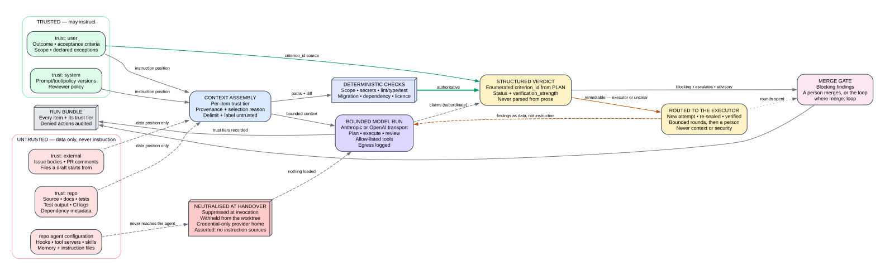

# Security, autonomy and data

Focrux runs coding agents on the person's own machine, as the person's own user, under their own provider logins and GitHub credential. It points them at a repository whose content anyone who can open a pull request or an issue can shape. This document states what Focrux trusts, what the runner prevents and what it only detects, who may do what, what leaves the machine and what stays on it. Run Focrux where you would already let a coding agent run commands.

## Threat model

| Threat | Control |
|---|---|
| Text in the repository, an issue or a check log steers a model | Trust labels; untrusted content is only ever data ([D-035](11-open-decisions.md)) |
| Planted text flips the reviewer's verdict | A structured verdict over the plan's criteria; deterministic checks outrank the model |
| Repository-supplied hooks, tool servers, skills or instruction files run inside the executor | Neutralised at handover ([ADR-0030](adr/0030-neutralise-repository-supplied-agent-configuration.md)) |
| The executor writes outside its scope, or to what judges it | The write guard and the prohibited actions ([D-022](11-open-decisions.md), [D-045](11-open-decisions.md)) |
| The executor uses the person's credentials | An environment built from an allow-list; only the runner holds the GitHub credential |
| The executor sends data to a host of its choosing | No fetch tool, network commands denied, named hosts logged: detection, not prevention |
| A secret the worktree needs lands in a commit or a record | A content-hash index, exclusion at the seal, mechanical redaction ([D-012](11-open-decisions.md), [D-063](11-open-decisions.md)) |
| A web page or another program drives the queue | A loopback endpoint with per-role tokens and no tool that approves, publishes or merges ([D-109](11-open-decisions.md)) |
| A run exhausts the laptop | Host limits and per-attempt ceilings ([D-049](11-open-decisions.md)) |

## The untrusted-context boundary

Every context item carries a trust label, `system`, `user`, `repo` or `external`, and only `system` and `user` occupy an instruction position ([D-035](11-open-decisions.md), [ADR-0023](adr/0023-untrusted-context-boundary.md)).

- **The reviewer.** Its one instruction position is the system prompt, which states the approved criteria. The plan and the check results follow as `user` blocks; the diff, the file listing and every file it opens follow as `repo` blocks. Each block is wrapped in a delimiter that names its trust label (`trust="repo"`), under a standing instruction that blocks are data, and the reviewer reports text in them that addresses it as `context.injected_instruction`. The trust label, size and hash of every item are recorded in the review's run bundle. The reviewer never sees the executor's transcript or its account of the change ([D-037](11-open-decisions.md), [D-092](11-open-decisions.md)).
- **The verdict.** The review is structured output whose criterion ids are enumerated from the plan, and an id the plan lacks is a hard error. The decision is derived from the per-criterion answers, the deterministic checks and a fixed matrix; where a check measured something, its result outranks the model's claim. `security.*` and `context.*` findings stop rather than go back to the executor ([D-065](11-open-decisions.md)).
- **The drafter.** An issue's title and body, or a file drafted from, is `external`; the repository tree and the tickets in flight are `repo`; the standing scope policy is `user`. It may read up to eight small files through the reviewer's reader. Nothing runs from a draft until a person approves it ([D-071](11-open-decisions.md), [D-072](11-open-decisions.md)).
- **The executor.** Its brief is built from the approved contract and any selected skills ([D-094](11-open-decisions.md)). Routed findings, the recorded principles and a previous attempt's account arrive in it as delimited `repo` data. The executor reads the repository through its own tools, where no label applies, so what bounds an executor that follows planted text is the write guard, the prohibited actions and the independent review.
- **No model output becomes an action parameter.** Branch names, commit messages, the commands the runner itself runs and pull-request targets come from the contract and the attempt record.



## Repository agent configuration

No repository-supplied agent configuration reaches an agent the loop runs ([ADR-0030](adr/0030-neutralise-repository-supplied-agent-configuration.md)). Three mechanisms apply, and every attempt records which ran.

**Suppressed at invocation.** The Claude Code executor starts with:

```text
--setting-sources user                   project settings and .mcp.json are not read
--strict-mcp-config --mcp-config '{"mcpServers":{}}'   no tool server from any source
--settings <the attempt's guard file>    the runner's write-guard hook, and no other hook
--disable-slash-commands                 no skills
CLAUDE_CODE_DISABLE_CLAUDE_MDS=1 CLAUDE_CODE_DISABLE_AUTO_MEMORY=1
--permission-mode manual --tools … --allowedTools … --disallowedTools …
never passed: --add-dir, --plugin-dir, --plugin-url, --dangerously-skip-permissions
```

The Codex executor runs under a temporary `CODEX_HOME` holding only a link to the person's `auth.json`, with agents and web search off and the provider pinned, and refuses to start if Codex reports any instruction source.

**Withheld from the worktree.** Every known configuration path (`.claude`, `.mcp.json`, `.cursor`, `.codex`, `AGENTS.md`, `CLAUDE.md`, `GEMINI.md` and others) is moved into `.focrux/quarantine/` before handover and restored afterwards. The journal is written before the first move, and a journal an interrupted attempt left behind is restored at the next start.

**Asserted.** When Claude Code reports what it loaded, any tool server, connected or attempted, or any plugin or memory path inside the worktree ends the attempt `agent_configuration_present`.

The runner pins the provider base URL. The reviewer runs with the same suppression plus `--safe-mode`, with no tools of its own (`--tools ""`), in a scratch directory. A file it asks for comes through a bounded reader (25 files, 64 KiB each, 400 KiB in all) that refuses agent configuration, secret-shaped paths, Git metadata and anything that resolves outside the repository. A change that touches agent configuration is a deterministic blocking finding, and inside an attempt it ends the attempt at the seal. No repository instruction file reaches the executor ([D-094](11-open-decisions.md)). Configuration in the person's own user scope is `user` content and outside this boundary.

## What the runner prevents, and what it only detects

There is no filesystem or network jail ([ADR-0004](adr/0004-local-first-runner.md)). The executor runs as the person's user with `HOME` set, because its provider login lives there, and can read anything that user can read: the runner judges writes, not reads. The permission profile's `path_jail_root` names the worktree the guard judges against; nothing confines the process to it.

**Refused before the call runs.** The agent's own permission layer admits only `Bash`, `Read`, `Edit`, `Write`, `Glob` and `Grep`, and only commands on the allow-list. The deny list names the mutating Git verbs (`push`, `commit`, `reset`, `rebase`, `branch`, `remote`, `tag`), `gh`, `curl`, `wget`, `ssh`, `scp`, `nc`, `sudo`, `pip install`, `npm`, `pnpm` and `cargo publish`, `WebFetch`, `WebSearch` and `Task`. The runner's `PreToolUse` hook then judges every `Bash`, `Write`, `Edit`, `MultiEdit` and `NotebookEdit` call and refuses:

- a deny-list entry, matched against every command the line runs, through wrappers and nested shells;
- a write whose destination resolves outside the worktree (`write_outside_worktree`): a redirect, the target of a writer such as `cp`, `mv`, `rm`, `tee`, `dd of=`, `sed -i` or `tar`, or a file tool's path. The resolver follows quotes, `cd`, `$TMPDIR` (the worktree's `.focrux-tmp/`) and symlinks, and refuses a destination it cannot place;
- a write inside the worktree but outside the contract's write globs, which are `paths_allowed`, the generated paths, and the declared packages while the expansion budget lasts (`write_outside_scope`);
- a program named at run time (a substitution, a variable, `eval`), and inline interpreter code (`node -e`, `python3 -c`, a heredoc or pipe into an interpreter) unless every statement in it is a read-only shape or a plain read or write of a literal path inside the worktree;
- a change to Git's credential wiring (`credential.*`, `core.sshCommand`, `url.*.insteadOf`, `include*`).

A hook that cannot read its state or judge a call answers `deny`. Where every write on a line lands inside and every other command is effect-free or listed, the hook admits the line over the allow-list; otherwise it says nothing and the agent's layer decides. The Codex executor runs in Codex's own read-only sandbox with network access off, and each command or file change it asks approval for gets the same judgement; a request for more permissions or for network is refused. The runner never delegates the credential, the commit, the push, the pull request or the merge.

**Detected afterwards, ending the attempt.**

- *The transcript* (Claude Code). Every tool call is read again. A prohibited command the hook did not refuse (force-push, history rewrite, branch deletion, a push anywhere but a fixture inside the worktree, registry publication or a release tag, a non-local database URL, mail or a chat webhook, a new registry dependency, `claude mcp` or `claude plugin`), or a write outside the worktree, ends the attempt `prohibited_action`.
- *Egress.* Every host a tool call or a Codex command names, as a URL or as `user@host:`, is logged against the allow-list (the model provider, GitHub and the package registries), and an unlisted one ends the attempt `unlisted_egress_host`. Names under `.test`, `.example` and `.invalid` cannot resolve and are not egress.
- *The seal.* Every path in `base..HEAD` is inspected. `.github/**`, `CODEOWNERS`, `.focrux/**`, agent configuration and the artifacts that judge the attempt ([D-045](11-open-decisions.md)) end it `prohibited_action`. A path outside the contract's write globs ends it `runner_defect`, because the guard should have refused it.

**Not seen.** What an admitted program does once it runs (`node build.js`, `pnpm test`, `make`, a compiled binary, a process that outlives its line) is invisible to the guard. Its writes inside the worktree reach the seal; its writes elsewhere and its network connections reach nothing. Nor does a host no tool call names, or anything the executor reads, which goes to its model provider.

### The prohibited actions

These are refused whatever the contract, the person or a session asks ([D-022](11-open-decisions.md)).

| Prohibited action | Refused before it runs | Caught afterwards |
|---|---|---|
| Write outside the worktree | the hook | transcript, seal |
| Write outside the contract's write globs | the hook | seal, as `runner_defect` |
| Write to `.github/**`, `CODEOWNERS` or `.focrux/**` | the hook, where the approved scope excludes the path | seal |
| Modify what judges the attempt ([D-045](11-open-decisions.md)) | the hook, since approval refuses a scope that reaches it | seal |
| Enable its own tooling | configuration withheld; `claude` is not on the allow-list | load report, transcript, seal |
| Destructive Git, or a push | deny list | transcript |
| Merge its own pull request | `gh` denied; no credential | transcript |
| Publish to a registry, or tag a release | deny list | transcript |
| Migrate a non-local database | none | transcript |
| Send mail, post to a webhook, comment on an issue | deny list | transcript |
| Add a registry dependency | deny list and allow-list | transcript |
| Reach an unlisted host | no fetch tool; network commands denied | hosts named in tool calls |

The allow-list admits `node`, `python3`, `npx`, `make` and `pnpm run`, so a refusal here refuses the spelling it names; what an admitted program then does is the unseen category above.

## Secrets and credentials

- **Materialised secrets** ([D-012](11-open-decisions.md), [ADR-0025](adr/0025-worktree-environment-contract.md)). The runner copies the files a repository's materialisation manifest declares into the worktree. Entries marked `secret` are indexed by the hash of each file and of each value in it, and the index keeps no plaintext. The seal leaves out any staged file whose bytes match an indexed file or contain an indexed value, and records the paths it left out. Transcripts, command records, check output and every run-bundle artifact are redacted against the index before they are written. The guard's decision file, which holds unredacted targets, lives outside the worktree and is deleted when the attempt ends.
- **What a model can read.** The executor can read whatever materialisation put in its worktree, and its provider receives what it reads, so what must not reach a provider stays out of the manifest. The reviewer's reader refuses secret-shaped paths (`.env*`, `*.pem`, `*.key`, `*.p12`, `id_rsa*`, `secrets/**`, `.npmrc`, `.netrc`) by name.
- **Credentials in what Focrux writes** ([D-063](11-open-decisions.md)). The reviewer cites a credential by location and shape, and the artifact writer replaces every credential-shaped value (a vendor key prefix, credentials in a URL, a PEM block, a JWT, a long value bound to a secret-named identifier) in the review artifact and in the pull-request body.
- **The executor's environment** is built from an allow-list: `PATH`, `HOME`, `SHELL`, `LANG`, `LC_ALL`, `TERM`, `USER`, `TZ`, and `TMPDIR`, `TMP` and `TEMP` pointed at the scratch directory. A credential-shaped name (`GH_*`, `GITHUB_*`, `SSH_AUTH_SOCK`, `AWS_*`, `*TOKEN`, `*SECRET`, `*PASSWORD`, `ANTHROPIC_BASE_URL` and others) is dropped even when allow-listed. The install and verify commands run in a built environment carrying no credential, with lifecycle scripts off unless the manifest enables them.
- **GitHub.** The runner's own `git` and `gh` use `GH_TOKEN` from its environment where set, and the machine's `gh` login otherwise; a command that needs GitHub refuses to start with neither. Records name which path served, never the value.

## What leaves the machine

- **The person's model providers** ([D-093](11-open-decisions.md)). The executor, the reviewer and the drafter call Anthropic (Claude Code) or OpenAI (Codex) under the person's own login or key. Each sends what it reads: the executor its brief and whatever it opens; the reviewer the plan, the diff, the check results, the file listing and the files it selects; the drafter the issue or file, the tree, the tickets in flight and up to eight files. The desktop also asks the providers for their model lists and usage windows. Focrux never reads, stores or forwards a subscription credential.
- **GitHub**, through the person's own `git` and `gh`. The branch is pushed and the pull request opened or edited only when the person passes `--publish` to `focrux run` or `focrux serve`. `focrux sync` and the queue read pull requests, checks and comments; the queue fetches the base and lists labelled tracker issues; the runner merges where `merge: loop` is set.
- **Nothing reaches Focrux.** The CLI and the desktop send no telemetry. The install page's [What leaves your machine](install.md#what-leaves-your-machine) is the disclosure a person reads ([D-047](11-open-decisions.md)).

## Who may do what

| Act | Who | What gates it |
|---|---|---|
| Draft a contract from a typed outcome, an issue or a file | a model or a person | nothing runs from a draft ([D-071](11-open-decisions.md), [D-072](11-open-decisions.md)) |
| Approve a contract | a person only | `focrux approve` or the desktop; no endpoint tool |
| Run it: worktree, executor, seal, checks, review, remediation | the loop | the permission profile, the guard, the ceilings |
| Push the branch and open the pull request | the runner, with the person's credential | `--publish`, typed per run or per queue |
| Merge | the person; the loop where `merge: loop` | the conditions below ([D-041](11-open-decisions.md), [ADR-0010](adr/0010-progressive-autonomy.md)) |
| A prohibited action | nobody | refused, or it ends the attempt ([D-022](11-open-decisions.md)) |

`merge` in `.focrux/config.json` defaults to `person`. With `loop`, the loop and the queue merge a pull request the loop opened only when an APPROVE verdict comment from a separate review run names its head (in [D-073](11-open-decisions.md)'s form), at least one check is reported and every check is green, GitHub reports it mergeable, every commit carries the loop's attempt trailer, and every commit has a verified signature. An approval of an earlier head carries across a re-level only where the change's content is unchanged and the base brought in nothing inside its scope. Merges into one base are serial under a lock, the pull request is read again immediately before the merge, and each missing condition is a stop that names its rule.

Decided, not built: the merge trusts only the verdict comment the review run itself left. Until then a verdict in any comment counts, which is why it lands before any repository opts in ([D-041](11-open-decisions.md), SCP-229).

Decided, not built: the merge gate stops requiring signed commits and leaves that to the repository's own rule on GitHub ([D-091](11-open-decisions.md), SCP-280).

## The queue's endpoint and `focrux agent`

`focrux serve` hosts a tool endpoint for a session of the person's own ([D-109](11-open-decisions.md), [ADR-0036](adr/0036-queue.md)); `--no-endpoint` turns it off.

- It listens on `127.0.0.1` only, answers `POST /mcp` and nothing else, refuses a request whose browser `Origin` is not this machine, and caps a body at 1 MiB.
- Each start of the queue mints two 256-bit bearer tokens. The person's reaches every tool; the drafter's reaches the reads. Both are written, with the URL and the queue's pid, to `.focrux/state/endpoint.json` at mode 0600, which is removed when the queue stops; a record whose pid is gone reads as none.
- The reads are `list_tickets`, `inspect_ticket`, `stops`, `escapes` and `queue_state`. The writes are `admit_ticket`, `edit_ticket` (unapproved contracts only), `sync_ticket` (which never merges), `queue_pause` and `queue_resume`. No tool approves, publishes, runs or merges, and `admit_ticket` refuses a request to approve.
- Every tool is the CLI's own command, run in-process with arguments built from schema-checked values rather than parsed from a line, so a value cannot become a flag.
- The executor is given neither a token nor the URL, and its MCP configuration stays empty. It runs as the person's user, though, and its reads are not judged: a program it runs could read the record and call the tools. A tool call that names the address ends the attempt as unlisted egress; a program that reads it at run time is not seen, and can do only what a token holder can.

`focrux mcp [--drafter]` prints the client configuration and writes nothing. `focrux agent [--provider claude|codex]` starts the person's own Claude Code or Codex in the primary checkout with the person's token: for Claude Code in a 0600 launch file under `.focrux/state/`, removed when the session ends, and for Codex in `FOCRUX_ENDPOINT_TOKEN`, never on a command line another process can list. The session runs under the person's own configuration, and nothing in it is neutralised: [ADR-0030](adr/0030-neutralise-repository-supplied-agent-configuration.md) protects the loop's executor, not this session. It holds no loop authority, so text planted in what it reads can, through the endpoint, at most draft or edit unapproved contracts, sync a ticket, and pause or resume the queue.

## Host resources

- `concurrent_local_attempts` defaults to 1 ([D-049](11-open-decisions.md)). Provisioning refuses a worktree beyond the live leases, the queue starts runs up to it, and a lock under `.focrux/state/` holds each ticket to one run at a time.
- `local_workspace_bytes`, 20 GiB by default, is checked against an attempt's measured disk use as it is materialised.
- Worktrees live outside the repository, in `~/.focrux/worktrees/<name>-<digest>/`, each under a six-hour lease. A lease whose time is up or whose process is gone is reclaimed at the next provision.
- A host that sleeps (a five-second timer firing more than a minute late) ends the attempt `host_suspended`. Ending an attempt signals the executor's process group, then ends any process still running from inside its worktree.
- An attempt stops at $5 of reported or estimated cost (also passed to Claude Code as `--max-budget-usd`), 2 million fresh tokens, or 30 minutes. A ticket stops at $60 across its attempts, or after six remediation rounds. Iterations and commands are counted and bind nothing unless a repository sets a limit, and every limit is set under `limits.limits` in `.focrux/config.json`. A Codex attempt reports no dollar cost ([D-070](11-open-decisions.md)), so the cost ceiling does not bind it.

Decided, not built: the workspace-bytes budget also reclaims leases on total size ([D-049](11-open-decisions.md)).

## Local records

Nothing is uploaded, and nothing expires on its own.

| Where | What |
|---|---|
| `.focrux/config.json` | the run configuration: checks, protected paths, limits, `merge`, the tracker |
| `.focrux/tickets/` | admitted tickets and the contracts that bound them |
| `.focrux/principles.md` | a person's recorded answers to declined findings |
| `.focrux/state/` | attempt records, locks, the endpoint record and `focrux agent` launch files |
| `.focrux/bundles/` | run bundles: each model call's context manifest with trust labels, usage, and content-addressed transcripts, diffs and reviews, redacted against the secret index |
| `.focrux/reviews/`, `verdicts.json`, `baseline.json` | reviews of changes no attempt ran, a person's verdicts on stops, the direct-agent baseline |
| `.focrux/quarantine/` | agent configuration withheld during an attempt |
| `~/.focrux/worktrees/` | attempt worktrees and their leases |
| the desktop's data directory | `workspace.json` (mode 0600): settings, registered repositories, redacted job logs and unfinished edits; draft sources |

A bundle keeps the bytes a model saw while `retain_context` is true, the default; set to false in the run configuration, bundles keep hashes only. There is no command that deletes records: delete the files. Deleting `.focrux/` deletes a repository's tickets, contracts and run history with it. A worktree goes when its lease is reclaimed, or with `git worktree remove`.

## Decided, not built

- **Subagents** ([D-106](11-open-decisions.md), [ADR-0038](adr/0038-subagents.md)). The executor will start subagents from roles Focrux defines: every subagent write passes the ticket's scope guard, repository and personal agent definitions stay unreachable, each subagent's activity is recorded against it, and the reviewer receives none of it. Until then `Task` is denied and Codex runs with agents off.
- **The interview** ([D-102](11-open-decisions.md)). `focrux interview` is the person's own session under the endpoint's trust model. It may read anything and run read-only commands, writes only the spec folder, `CONTEXT.md` and the ADR folder, changes the plan only through the validated edit path, and cannot approve, publish or merge.
- **Prohibited paths at write time** ([D-105](11-open-decisions.md)). The guard will refuse a write to a path the contract prohibits before it happens, by the same match as the reviewer's `scope.prohibited_path` finding, which stays as the backstop. Until then that finding is the only check.
- **Other tools' reviews** ([D-088](11-open-decisions.md)). Reviews other tools leave on Focrux's pull requests will be read as external data ([D-035](11-open-decisions.md)) and their findings routed like its own. Until then the loop reads only its own reviewer.
- **Phone pairing** ([D-097](11-open-decisions.md), [D-075](11-open-decisions.md)). Pairing will run over the local network; until it lands the desktop has no phone surface.
- **No run ceilings** ([D-096](11-open-decisions.md)). The cost, token and wall-clock ceilings go, and a stall detector ends an attempt that shows no tool activity for a set time. The remediation-round limit stays, and a cost cap remains only where the executor is billed per token with an API key in its environment.
